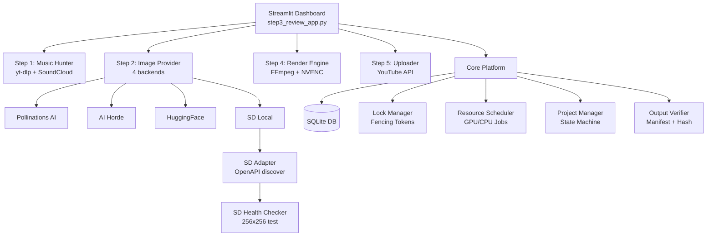

# 🎵 Lofi Studio AI — Tự động hoá tạo video Lofi

> **Bộ công cụ tự động hoàn chỉnh** để tạo video Lofi chất lượng cao: từ tìm kiếm nhạc bản quyền tự do → sinh ảnh nền AI → dựng video với hiệu ứng → tải lên YouTube, tất cả điều khiển qua một Dashboard trực quan.

[](https://python.org)
[](https://streamlit.io)
[](LICENSE)

---

## 📋 Mục lục

- [Tính năng nổi bật](#-tính-năng-nổi-bật)
- [Yêu cầu hệ thống](#-yêu-cầu-hệ-thống)
- [Cài đặt & Khởi chạy nhanh](#-cài-đặt--khởi-chạy-nhanh)
- [Cấu trúc dự án](#-cấu-trúc-dự-án)
- [Hướng dẫn sử dụng Dashboard](#-hướng-dẫn-sử-dụng-dashboard)
- [Cài đặt Stable Diffusion Local](#-cài-đặt-stable-diffusion-local)
- [Cấu hình nâng cao](#-cấu-hình-nâng-cao)
- [Kiến trúc kỹ thuật](#-kiến-trúc-kỹ-thuật)
- [Bộ kiểm thử tự động](#-bộ-kiểm-thử-tự-động)

---

## ✨ Tính năng nổi bật

| Tính năng | Mô tả |
|---|---|
| 🎵 **Tìm nhạc tự động** | Tìm kiếm & tải nhạc Lofi miễn phí bản quyền từ SoundCloud qua `yt-dlp` |
| 🎨 **Sinh ảnh nền AI** | Hỗ trợ 4 nguồn: Pollinations AI, AI Horde, Hugging Face, và Stable Diffusion Local |
| 🎬 **Dựng video GPU** | Render Full HD 1920×1080 với NVENC (GPU) hoặc libx264 (CPU), có hiệu ứng overlay |
| 🛡️ **Kiểm soát bản quyền** | Hệ thống schema & kiểm duyệt quyền tác giả trước khi xuất bản |
| 📊 **Dashboard trực quan** | Giao diện Streamlit 4-tab với thiết kế glassmorphism, điều hướng intuitive |
| 🤖 **Quản lý SD Local** | Trỏ đến AUTOMATIC1111 có sẵn **hoặc** để App tự tải & cài đặt |
| ✅ **Bộ kiểm thử đầy đủ** | 7 unit test tự động bao phủ DB, lock, scheduler, render, SD gates |

---

## 💻 Yêu cầu hệ thống

| Thành phần | Tối thiểu | Khuyến nghị |
|---|---|---|
| **OS** | Windows 10 64-bit | Windows 11 64-bit |
| **Python** | 3.10+ | 3.11+ |
| **RAM** | 8 GB | 16 GB |
| **GPU (tuỳ chọn)** | NVIDIA 4GB VRAM | NVIDIA RTX 3050 Ti+ |
| **Ổ cứng trống** | 5 GB | 15 GB (nếu cài SD Local) |
| **FFmpeg** | Bắt buộc | Bắt buộc |
| **Git** | Cần nếu cài SD Auto | Cần nếu cài SD Auto |

> **Lưu ý:** App chạy hoàn toàn offline sau khi cài đặt. Kết nối Internet chỉ cần cho bước tìm nhạc và tải ảnh từ nguồn trực tuyến.

---

## 🚀 Cài đặt & Khởi chạy nhanh

### Bước 1: Clone repository

```bash
git clone https://github.com/MTrong2004/Lofi_Auto.git
cd Lofi_Auto
```

### Bước 2: Cài đặt dependencies

```bash
pip install -r requirements.txt
```

> **Đảm bảo FFmpeg đã được cài đặt và có trong PATH:**
> Tải từ https://ffmpeg.org/download.html hoặc dùng `winget install ffmpeg`

### Bước 3: Khởi chạy Dashboard

```bash
python -m streamlit run step3_review_app.py
```

Dashboard tự động mở trên trình duyệt tại `http://localhost:8501`.

### (Tuỳ chọn) Chạy qua dòng lệnh

```bash
# Kiểm tra hệ thống nhanh
python system_check.py

# Chạy pipeline test 10 giây
python main.py --test

# Chạy pipeline đầy đủ
python main.py
```

---

## 📁 Cấu trúc dự án

```
lofi_automation/
├── 📄 main.py                    # Pipeline orchestrator chính
├── 📄 config.py                  # Cấu hình toàn cục (paths, API keys)
├── 📄 system_check.py            # Kiểm tra phần cứng & dependencies
├── 📄 test_suite.py              # Bộ 7 unit test tự động
├── 📄 requirements.txt           # Danh sách dependencies
│
├── 🎵 step1_music_hunter.py      # Tìm kiếm & tải nhạc SoundCloud
├── 🎨 step2_image_provider.py    # Sinh ảnh nền AI (multi-provider)
├── 🖥️  step3_review_app.py        # Streamlit Dashboard chính (4 tabs)
├── 🎬 step4_render.py            # Engine dựng video FFmpeg
├── ☁️  step5_uploader.py          # Tải video lên YouTube
│
└── core/                        # Các module lõi (G3-G4)
    ├── 📄 db.py                  # SQLite database & migrations
    ├── 📄 schemas.py             # Schema validation (12 schemas)
    ├── 📄 project_manager.py     # Quản lý vòng đời Project
    ├── 📄 lock_manager.py        # Distributed locking & fencing tokens
    ├── 📄 resource_scheduler.py  # GPU/CPU job scheduler
    ├── 📄 render_worker.py       # Worker render phân đoạn video
    ├── 📄 cache_manager.py       # SHA-256 cache & dedup
    ├── 📄 media_probe.py         # FFprobe audio/video analysis
    ├── 📄 output_verifier.py     # Xác minh video đầu ra & manifest
    ├── 📄 provider_capability.py # Registry khả năng image providers
    ├── 📄 sd_adapter.py          # API adapter cho AUTOMATIC1111
    ├── 📄 sd_health.py           # Health check & báo cáo SD
    ├── 📄 sd_installer.py        # Bộ cài đặt tự động SD WebUI
    ├── 📄 sd_process_manager.py  # Quản lý tiến trình SD server
    └── 📄 sd_model_manager.py    # Quản lý model & exclusive lease
```

---

## 🖥️ Hướng dẫn sử dụng Dashboard

Mở Dashboard bằng lệnh `python -m streamlit run step3_review_app.py`.

### Tab 1 — ⚙️ Cấu hình hệ thống

- Cấu hình thư mục lưu video đầu ra
- Chọn nhà cung cấp tạo ảnh AI (Pollinations / AI Horde / Hugging Face / SD Local)
- Nhập API Keys tương ứng
- **Quản lý Stable Diffusion Local** (trỏ đến bản có sẵn hoặc cài tự động)

### Tab 2 — 🎵 Bước 1: Tìm nhạc

- Chọn nhanh thể loại từ lưới Lofi Hot (Chill, Study, Rain, Jazz...)
- Tìm kiếm tự do từ SoundCloud
- Nghe thử preview, xem thông tin bản quyền và chọn bài

### Tab 3 — 🎨 Bước 2/3: Sinh ảnh & Hiệu ứng

- Nhập prompt mô tả cảnh nền (hoặc dùng prompt ngẫu nhiên)
- Chọn hiệu ứng overlay (mưa, bụi, film grain, scanlines...)
- Tải lên ảnh nền tuỳ chỉnh

### Tab 4 — 🚀 Bước 4: Dựng video

- Xem lại tóm tắt toàn bộ thiết lập
- Bấm **Render** để tạo video Full HD
- Tải xuống hoặc tải lên YouTube trực tiếp

---

## 🤖 Cài đặt Stable Diffusion Local

Dashboard cung cấp **hai chế độ** để tích hợp AUTOMATIC1111 WebUI vào pipeline tạo ảnh:

### Chế độ 1 — 📁 Trỏ đến bản đã cài sẵn (Khuyến nghị)

Nếu bạn **đã cài AUTOMATIC1111** trên máy, chọn chế độ này:

1. Trong Tab 1, chọn **Stable Diffusion Local** làm nhà cung cấp ảnh
2. Cuộn xuống phần **🛠️ Trình quản lý Stable Diffusion**
3. Chọn radio **"📁 Trỏ đến bản đã cài"**
4. Nhập đường dẫn thư mục gốc AUTOMATIC1111 (ví dụ: `D:/stable-diffusion-webui`)
5. App tự động phát hiện `webui-user.bat` / `launch.py` và xác nhận
6. Bấm **💾 Lưu đường dẫn & Áp dụng**
7. Bật API flag trong `webui-user.bat`:
   ```batch
   set COMMANDLINE_ARGS=--api --medvram
   ```
8. Khởi động AUTOMATIC1111 thủ công → Bấm **🔗 Kiểm tra kết nối**

> **App không thay đổi bất kỳ file nào** trong thư mục cài đặt của bạn.

### Chế độ 2 — 🚀 Để App tự động tải & cài đặt

Nếu bạn **chưa có AUTOMATIC1111**, App sẽ cài đặt hoàn toàn tự động:

1. Chọn radio **"🚀 Để App tự động tải & cài đặt"**
2. Nhập đường dẫn thư mục đích (cần ≥10GB trống)
3. Bấm **🩺 Kiểm tra phần cứng** để xác minh điều kiện
4. Bấm **🚀 Bắt đầu tải & cài đặt tự động**
5. App sẽ tự động:
   - Clone AUTOMATIC1111 v1.6.0 (commit chính thức, không tự cập nhật)
   - Tạo Python Virtual Environment riêng biệt
   - Cài PyTorch CUDA + các thư viện cần thiết
6. Sau khi cài xong, dùng **🎛️ Bảng điều khiển Server** để Start/Stop

> **An toàn:** App chỉ cài vào thư mục bạn chỉ định, không sửa đổi Python hệ thống, PATH hay Registry.

---

## ⚙️ Cấu hình nâng cao

Chỉnh sửa [`config.py`](config.py) để tuỳ biến:

```python
# Thư mục lưu trữ
OUTPUT_DIR = Path("data/output")
TEMP_IMAGE_DIR = Path("data/temp_image")
EFFECTS_DIR = Path("data/effects")

# Stable Diffusion Local
SD_LOCAL_API_URL = "http://127.0.0.1:7860"
SD_LOCAL_CHECKPOINT = "sd_v1.5_anime.safetensors"
SD_LOCAL_STEPS = 24
SD_LOCAL_WIDTH = 1024
SD_LOCAL_HEIGHT = 576

# Pollinations AI
POLLINATIONS_BASE_URL = "https://image.pollinations.ai/prompt"
POLLINATIONS_API_KEY = ""  # Để trống cho bản miễn phí

# Video render
VIDEO_WIDTH = 1920
VIDEO_HEIGHT = 1080
VIDEO_FPS = 24
```

### API Keys

Tạo file `secrets/api_keys.json`:

```json
{
  "pollinations_key": "",
  "pexels_api_key": "your_pexels_key_here",
  "ai_horde_key": "your_horde_key",
  "huggingface_token": "hf_xxx"
}
```

> File `secrets/` đã được thêm vào `.gitignore`, không bao giờ bị đẩy lên GitHub.

---

## 🏗️ Kiến trúc kỹ thuật



### Cơ chế bảo vệ dữ liệu

- **Atomic Write:** Mọi file metadata đều được ghi nguyên tử (`write → fsync → os.replace`)
- **Fencing Tokens:** Ngăn race condition khi nhiều worker cùng truy cập tài nguyên
- **Exclusive Model Lease:** Ngăn xung đột checkpoint SD khi nhiều job GPU chạy đồng thời
- **Schema Validation:** 12 schemas kiểm tra toàn vẹn dữ liệu trước khi ghi DB

---

## 🧪 Bộ kiểm thử tự động

Chạy toàn bộ 7 unit test:

```bash
python test_suite.py
```

| Test | Phạm vi kiểm thử |
|---|---|
| `test_01` | Kiểm tra bảng và schema SQLite |
| `test_02` | Atomic file writer & fsync |
| `test_03` | Lock Manager & Fencing Token |
| `test_04` | Resource Scheduler job lifecycle |
| `test_05` | Worker process tree termination |
| `test_06` | Output Verifier & Manifest |
| `test_07` | **SD Gates G3/G4** — SDAdapter, SDModel, Health Check (mocked) |

---

## 📜 Giấy phép

Dự án phát hành dưới giấy phép **MIT License**.  
Âm nhạc được sử dụng phải tuân thủ giấy phép của nguồn gốc (CC, SoundCloud terms...).

---

## 👤 Tác giả

**MTrong2004** — [GitHub](https://github.com/MTrong2004/Lofi_Auto)

> *Được phát triển với sự hỗ trợ của Antigravity AI (Google DeepMind)*
