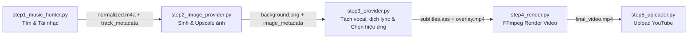
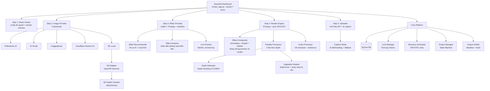

# 🎵 Lofi Studio AI — Tự động hoá tạo video Lofi

> **Bộ công cụ tự động hoàn chỉnh** để tạo video Lofi chất lượng cao: từ tìm kiếm nhạc bản quyền tự do → sinh ảnh nền AI → dựng video với hiệu ứng → tải lên YouTube, tất cả điều khiển qua một Dashboard trực quan.

[](https://python.org)
[](https://streamlit.io)
[](LICENSE)

---

## 📋 Mục lục

- [Tính năng nổi bật](#-tính-năng-nổi-bật)
- [Yêu cầu hệ thống](#-yêu-cầu-hệ-thống)
- [Cài đặt & Khởi chạy nhanh](#-cài-đặt--khởi-chạy-nhanh)
- [Cấu trúc dự án](#-cấu-trúc-dự-án)
- [Sơ đồ liên kết & Phụ thuộc](#-sơ-đồ-liên-kết--phụ-thuộc-giữa-các-file)
- [Hướng dẫn sử dụng Dashboard](#-hướng-dẫn-sử-dụng-dashboard)
- [Cài đặt Stable Diffusion Local](#-cài-đặt-stable-diffusion-local)
- [Cấu hình nâng cao](#-cấu-hình-nâng-cao)
- [Kiến trúc kỹ thuật](#-kiến-trúc-kỹ-thuật)
- [Bộ kiểm thử tự động](#-bộ-kiểm-thử-tự-động)

---

## ✨ Tính năng nổi bật

| Tính năng | Mô tả |
|---|---|
| 🎵 **Tìm nhạc đa nguồn** | Duyệt song song 4 nguồn whitelist (SoundCloud NCS/free + YouTube NCS/free) qua `yt-dlp`, tự khử trùng lặp, lọc mix dài & label thương mại |
| ▶️ **Nghe thử không cần tải** | Phát stream trực tiếp trong Dashboard qua `yt-dlp -g`, không tải file về máy |
| 📂 **Nhập nhạc từ file local** | Tải MP3/WAV từ thư viện miễn phí (Pixabay Music, StockTune, Chosic, FMA...) rồi nhập vào pipeline ở Bước 2 — tự chuẩn hóa m4a, khai nguồn + license để sinh credit, khử trùng lặp theo hash nội dung |
| 🎨 **Sinh ảnh nền AI (5 nguồn)** | Pollinations AI, AI Horde, Hugging Face, Cloudflare Workers AI, Stable Diffusion Local — thứ tự ưu tiên cấu hình được qua `.env` |
| ✍️ **LLM viết prompt theo bài nhạc** | Cấu hình LLM dùng chung cho prompt ảnh, hiệu ứng, caption YouTube và dịch lời — mặc định Gemini (cắm key), tự fallback sang Pollinations miễn phí khi lỗi/hết quota |
| 🏔️ **Parallax 2.5D theo độ sâu thật** | Tách 3 lớp bằng Depth Anything V2 (onnxruntime CPU, ~1s/ảnh); chuyển động camera-pan vật lý (lớp gần dịch nhiều) + zoom Ken Burns chậm, nối segment liền mạch |
| 🍃 **Chuyển động sống theo từng lớp** | Tự nhận diện từ prompt: mây hậu cảnh trôi chậm, đèn thành phố nhấp nháy nhè nhẹ — trung cảnh giữ yên |
| 🌿 **Lá cây lay riêng từng vùng** | Segmentation thực vật (SegFormer ONNX ~4MB, CPU) + warp displace FFmpeg với sóng sin lệch pha — từng cụm lá lay nhịp riêng như gió thổi, vật thể khác đứng yên |
| ✨ **Hiệu ứng sinh bằng code** | Mưa rơi/tuyết rơi/bụi bay có quỹ đạo thật + scanline + film grain, lặp khít (seamless loop), không cần tải footage |
| 🟢 **Chroma key phông xanh thật** | Tự nhận diện video phông xanh/nền đen/alpha (phân tích khung hình local), tách nền bằng `chromakey + despill + feather` trong FFmpeg và WebGL shader trong Live Preview — không còn viền xanh như blend screen |
| 🧩 **Filter builder dùng chung** | `core/effect_compositor.py` sinh một chuỗi filter duy nhất cho cả preview 10 giây lẫn render cuối — chỉnh opacity/tốc độ/chroma ở đâu thì mọi nơi khớp nhau |
| 🤖 **AI đề xuất hiệu ứng local-first** | AI tạo hồ sơ (effect_type + query đúng loại asset), xếp hạng thư viện local trước, thiếu mới gọi Pixabay — tiết kiệm quota, chạy được offline |
| 🎧 **Chất âm lofi đặc trưng** | Slowed 0.88x + lowpass ấm + compressor; tiếng mưa & vinyl crackle tự sinh bằng code |
| 🎚️ **Chỉnh âm / Remix (bước riêng)** | Bước wizard riêng: tempo (giữ cao độ), đổi cao độ (pitch, giữ thời lượng qua `rubberband`), EQ bass/treble, lowpass, reverb, compressor, chuẩn hóa — có nghe thử 20s |
| 🎶 **Mix nhiều bài → video dài** | Chọn nhiều bài đã tải, nối crossfade thành 1 audio-master; thời lượng video tự tính theo tổng các bài |
| ✒️ **Typo theo thể loại + con dấu** | Preset chữ tự chọn theo thể loại (Trung cổ phong dọc + **con dấu đỏ**, Việt/V-Pop, Lofi); font OFL bundle Noto Serif SC + Be Vietnam Pro |
| 🎬 **Dựng video GPU/CPU tự động** | Tự dò GPU bằng test encode NVENC thật: máy có GPU dùng `h264_nvenc`, không có tự chuyển `libx264` — không cần cấu hình tay |
| ✍️ **Chữ nghệ thuật AI cho video** | AI gợi ý chữ ngắn theo nhạc, mood và ảnh nền; hỗ trợ chữ chính, bản dịch hoặc phiên âm, bố cục dọc/ngang, ưu tiên đặt cạnh nhân vật và tránh che chủ thể. Chữ được render trực tiếp vào video, tách biệt với phụ đề. |
| ☁️ **Upload YouTube + AI caption** | Bước 7 của wizard: AI viết title/description/hashtag (chỉnh tay được), chọn chế độ đăng/lịch đăng, upload resumable có tiến độ |
| 🛡️ **Kiểm soát bản quyền** | Hệ thống schema & kiểm duyệt quyền tác giả trước khi xuất bản |
| 📊 **Dashboard trực quan** | Giao diện Streamlit wizard 7 bước, điều hướng có điều kiện, preview trực tiếp |
| 🤖 **Quản lý SD Local** | Trỏ đến AUTOMATIC1111 có sẵn **hoặc** để App tự tải & cài đặt — xem [hướng dẫn bên dưới](#-cài-đặt-stable-diffusion-local) |
| ✅ **Bộ kiểm thử đầy đủ** | 13 unit test tự động bao phủ DB, lock, scheduler, render, SD gates, audio vibe, upscale, parallax |

---

## 💻 Yêu cầu hệ thống

| Thành phần | Tối thiểu | Khuyến nghị |
|---|---|---|
| **OS** | Windows 10 64-bit | Windows 11 64-bit |
| **Python** | 3.10+ | 3.11+ |
| **RAM** | 8 GB | 16 GB |
| **GPU (tuỳ chọn)** | NVIDIA 4GB VRAM | NVIDIA RTX 3050 Ti+ |
| **Ổ cứng trống** | 5 GB | 15 GB (nếu cài SD Local) |
| **FFmpeg** | Bắt buộc | Bắt buộc |
| **Git** | Cần nếu cài SD Auto | Cần nếu cài SD Auto |

> **Lưu ý:** App chạy hoàn toàn offline sau khi cài đặt. Kết nối Internet chỉ cần cho bước tìm nhạc và tải ảnh từ nguồn trực tuyến.

---

## 🚀 Cài đặt & Khởi chạy nhanh

### Bước 1: Clone repository

```bash
git clone https://github.com/MTrong2004/Lofi_Auto.git
cd Lofi_Auto
```

### Bước 2: Cài đặt dependencies

```bash
pip install -r requirements.txt
```

> **Đảm bảo FFmpeg đã được cài đặt và có trong PATH:**
> Tải từ https://ffmpeg.org/download.html hoặc dùng `winget install ffmpeg`

> **Lưu ý:** Lần đầu render với Parallax, app tự tải 2 model ONNX từ HuggingFace
> về `data/models/` (chỉ tải một lần): Depth Anything V2 Small (~25MB, tách lớp
> theo độ sâu) và SegFormer-B0 ADE20K (~4.4MB, mask vùng cây lá cho hiệu ứng lay).

### Bước 3: Khởi chạy Dashboard

```bash
python -m streamlit run review_app.py
```

Dashboard tự động mở trên trình duyệt tại `http://localhost:8501`.

### (Tuỳ chọn) Chạy qua dòng lệnh

```bash
# Kiểm tra hệ thống nhanh
python system_check.py

# Chạy pipeline test 10 giây
python main.py --test

# Chạy pipeline đầy đủ
python main.py
```

---

## 📁 Cấu trúc dự án

```
lofi_automation/
├── 📄 main.py                    # Pipeline orchestrator chính (chạy batch hoặc test qua CLI)
├── 📄 app_server.py              # Server API FastAPI (REST backend cung cấp dịch vụ)
├── 📄 config.py                  # Cấu hình toàn cục (thư mục, API keys, cài đặt audio/video/AI)
├── 📄 system_check.py            # Kiểm tra phần cứng & kiến nghị cấu hình SD Local
├── 📄 test_suite.py              # Bộ 13 unit test tự động kiểm thử toàn hệ thống
├── 📄 requirements.txt           # Các thư viện Python cần thiết
│
├── 📄 .env.example               # Mẫu cấu hình môi trường (sao chép thành .env để tùy chỉnh)
│
├── 🎵 step1_music_hunter.py      # Bước 1: Tìm nhạc SoundCloud/YouTube, tải về và chuẩn hóa âm lượng
├── 🎨 step2_image_provider.py    # Bước 2: Sinh ảnh nền AI từ 5 provider, upscale lên 1080p
├── 🎤 step3_provider.py          # Bước 3: Tách vocal, nhận diện lời (Whisper), dịch, sinh phụ đề .ass & quản lý hiệu ứng
├── 🎬 step4_render.py            # Bước 4: Engine dựng video FFmpeg (segmenting, mix lofi audio, apply overlays/subtitles)
└── ☁️  step5_uploader.py          # Bước 5: Upload YouTube API v3 (resumable, viết caption AI, hẹn giờ phát)
│
├── 📁 components/
│   └── 📁 effect_live_preview/   # Live Preview HTML/WebGL chroma key để kiểm tra overlay trực tiếp trên trình duyệt
│
├── 📁 utils/
│   └── 📄 helpers.py             # Các hàm dùng chung: LLM prompt, MetadataStore, retry logic
│
└── 📁 core/                      # Các module cốt lõi của nền tảng
    ├── 📁 runtime/               # Vòng đời, DB và quản lý luồng công việc
    │   ├── 📄 db.py              # SQLite database & migrations (quản lý 8 bảng thực thể)
    │   ├── 📄 schemas.py         # Xác thực dữ liệu thông qua 12 JSON schemas
    │   ├── 📄 project_manager.py # Quản lý trạng thái và ghi đè an toàn (Atomic Write) cho project.json
    │   ├── 📄 lock_manager.py    # Quản lý khóa ghi độc quyền & Fencing Tokens tránh race-condition
    │   ├── 📄 resource_scheduler.py # Điều phối CPU/GPU để thực hiện hàng đợi render
    │   ├── 📄 render_worker.py   # Quản lý tiến trình con để render song song phân đoạn video
    │   └── 📄 cache_manager.py   # Tránh trùng lặp tài nguyên dựa trên mã băm SHA-256
    │
    ├── 📁 media/                 # Xử lý âm thanh, video và phân tích kỹ thuật
    │   ├── 📄 audio_processor.py # Chất âm lofi, remix tham số hoá (EQ/tempo/pitch/reverb), nối nhiều bài (concat_tracks), ambience, chuẩn hóa
    │   ├── 📄 output_verifier.py # Xác minh định dạng video đầu ra và tính toàn vẹn của manifest
    │   └── 📄 probe.py           # FFprobe thu thập thông số luồng âm thanh/hình ảnh
    │
    ├── 📁 effects/               # Phân tích và hòa trộn hiệu ứng video
    │   ├── 📄 analyzer.py        # Tự động nhận diện loại nền của video hiệu ứng (black/chroma/alpha)
    │   ├── 📄 compositor.py      # Xây dựng filter complex FFmpeg ghép overlay (despill, soft-feather chroma)
    │   ├── 📄 manifest.py        # Quản lý trạng thái và đăng ký manifest hiệu ứng overlay local
    │   └── 📄 recommender.py     # Đề xuất và xếp hạng hiệu ứng local-first theo vibe nhạc/ảnh
    │
    ├── 📁 text/                  # Xử lý phụ đề, AI caption và chữ nghệ thuật
    │   ├── 📄 ass_renderer.py    # Biên dịch lời nhạc/karaoke sang phụ đề nâng cao .ass
    │   ├── 📄 caption_writer.py  # LLM gợi ý viết tiêu đề, mô tả và hashtag cho YouTube
    │   ├── 📄 effect_manifest.py # Quản lý cấu hình chữ nghệ thuật của dự án
    │   ├── 📄 effect_recommender.py # AI đề xuất câu chữ nghệ thuật theo bối cảnh
    │   ├── 📄 effect_renderer.py # Tạo chữ nghệ thuật động bằng filter ASS
    │   └── 📄 provider.py        # Quản lý font chữ và tạo cache key cho chữ nghệ thuật
    │
    ├── 📁 image/                 # Xử lý ảnh nền, Stable Diffusion và 3D Parallax
    │   ├── 📄 depth_estimator.py # Ước lượng bản đồ độ sâu sử dụng Depth Anything V2 ONNX
    │   ├── 📄 vegetation_masker.py # Tạo mặt nạ thực vật sử dụng SegFormer ONNX để lay cây lá
    │   ├── 📄 parallax_processor.py # Pan camera và làm lay động lá cây (displacement warp FFmpeg)
    │   ├── 📄 scene_layer_processor.py # Quản lý và xử lý phân tách các lớp ảnh nền
    │   ├── 📄 provider_capability.py # Registry các khả năng của image providers
    │   ├── 📄 sd_manager.py      # Quản lý vòng đời SD Local (tải, cài đặt, API, extension allowlist)
    │   └── 📄 upscaler.py        # Phóng to ảnh nền lên Full HD 1080p
    │
    └── 📁 lyrics/                # Xử lý giọng nói và tìm lời nhạc
        ├── 📄 vocal_separator.py # Tách nguồn âm thanh thành Vocal & Instrumental (Demucs)
        ├── 📄 transcriber.py     # Nhận diện giọng hát thành chữ sử dụng OpenAI Whisper
        └── 📄 translator.py      # LLM dịch nghĩa lời nhạc sang tiếng Việt / sinh phiên âm Pinyin
```

---

## 🔗 Sơ đồ liên kết & Phụ thuộc giữa các file

Để vận hành toàn bộ hệ thống, các script cấp cao (Top-level) tương tác với nhau theo một quy trình khép kín và tận dụng các module lõi nằm trong thư mục `core/`.

### 1. Luồng dữ liệu của Pipeline chính
Dưới đây là sơ đồ thể hiện luồng đi của dữ liệu từ Bước 1 đến Bước 5:



### 2. Bản đồ Import và Lời gọi giữa các File (Dependency Map)

Bảng dưới đây thống kê chi tiết mối liên kết nhập (import) và sử dụng tài nguyên trực tiếp giữa các script:

| File nguồn (Source Script) | File/Module được import (Imported Module) | Mục đích sử dụng / API chính được gọi |
|---|---|---|
| **main.py** | [step1_music_hunter.py](file:///c:/Users/trong/OneDrive%20-%20bm2004/Documents/VS%20Code/lofi_automation/step1_music_hunter.py) | Gọi `run_step1(project_id)` để tải nhạc tự động |
| | [step2_image_provider.py](file:///c:/Users/trong/OneDrive%20-%20bm2004/Documents/VS%20Code/lofi_automation/step2_image_provider.py) | Gọi `get_background_image()` để sinh/tải ảnh nền |
| | [step3_provider.py](file:///c:/Users/trong/OneDrive%20-%20bm2004/Documents/VS%20Code/lofi_automation/step3_provider.py) | Gọi `pick_effect_video()` để chọn hiệu ứng mặc định |
| | [step4_render.py](file:///c:/Users/trong/OneDrive%20-%20bm2004/Documents/VS%20Code/lofi_automation/step4_render.py) | Gọi `run_step4()` để tiến hành render video Full HD |
| | [step5_uploader.py](file:///c:/Users/trong/OneDrive%20-%20bm2004/Documents/VS%20Code/lofi_automation/step5_uploader.py) | Gọi `upload_video()` để tải thành phẩm lên YouTube |
| | `core.runtime.db` | Gọi `init_db()` để khởi tạo cơ sở dữ liệu SQLite lúc bắt đầu |
| | `core.runtime.project_manager` | Gọi `ProjectManager.create_project()` đăng ký vòng đời dự án |
| | `core.text.effect_manifest` | Nạp/Lưu cấu hình chữ nghệ thuật động (`load_text_profile`, `save_text_profile`) |
| | `core.text.provider` | Gọi `build_ai_text_profile()` để LLM gợi ý chữ |
| **review_app.py** | [step1_music_hunter.py](file:///c:/Users/trong/OneDrive%20-%20bm2004/Documents/VS%20Code/lofi_automation/step1_music_hunter.py) | Duyệt nhạc, nghe thử không tải, tính điểm trend nhạc, nhập nhạc từ file local (`import_local_track`, `list_local_imports`) |
| | [step2_image_provider.py](file:///c:/Users/trong/OneDrive%20-%20bm2004/Documents/VS%20Code/lofi_automation/step2_image_provider.py) | Sinh ảnh AI, quản lý SD Local, xử lý ảnh upload |
| | [step3_provider.py](file:///c:/Users/trong/OneDrive%20-%20bm2004/Documents/VS%20Code/lofi_automation/step3_provider.py) | Tìm lời online, chạy Whisper/Demucs, dịch, lưu cấu hình phụ đề, quản lý/tải và đề xuất hiệu ứng overlay |
| | [step4_render.py](file:///c:/Users/trong/OneDrive%20-%20bm2004/Documents/VS%20Code/lofi_automation/step4_render.py) | Gọi render video preview 10 giây hoặc render video bản đầy đủ |
| | [step5_uploader.py](file:///c:/Users/trong/OneDrive%20-%20bm2004/Documents/VS%20Code/lofi_automation/step5_uploader.py) | Kiểm tra điều kiện upload, sinh mô tả AI và thực thi upload YouTube |
| | Các module thuộc `core/` | Tương tác trực tiếp để cập nhật giao diện: DB, LockManager, ResourceScheduler, RenderWorker, SDInstaller, ParallaxProcessor, v.v. |
| **app_server.py** | [step1_music_hunter.py](file:///c:/Users/trong/OneDrive%20-%20bm2004/Documents/VS%20Code/lofi_automation/step1_music_hunter.py) | API `/api/music/search` và `/api/music/download` |
| | [step2_image_provider.py](file:///c:/Users/trong/OneDrive%20-%20bm2004/Documents/VS%20Code/lofi_automation/step2_image_provider.py) | API `/api/image/generate` |
| | [step4_render.py](file:///c:/Users/trong/OneDrive%20-%20bm2004/Documents/VS%20Code/lofi_automation/step4_render.py) | Tác vụ chạy nền `bg_render_task` của API `/api/render` |
| | [system_check.py](file:///c:/Users/trong/OneDrive%20-%20bm2004/Documents/VS%20Code/lofi_automation/system_check.py) | API `/api/system/check` kiểm tra phần cứng |
| | `core.image.sd_manager` | Dùng `SDProcessManager` quản lý Start/Stop AUTOMATIC1111 |
| | `core.image.upscaler` | Dùng `ImageUpscaler` phóng đại Full HD cho ảnh tạo qua API |
| **step1_music_hunter.py** | `core.runtime.db` | Gọi `get_db_connection()` kết nối SQLite để lưu thông tin nhạc |
| | `core.media.probe` | Dùng `MediaProbe` chạy FFprobe lấy thông số âm thanh và kiểm tra lỗi |
| | `core.runtime.cache_manager` | Lưu trữ file nhạc và tránh tải lại trùng lặp dựa trên SHA-256 |
| | `core.runtime.schemas` | Xác thực tính hợp lệ của metadata nhạc thông qua `validate_data_schema` |
| | `core.runtime.project_manager` | Gọi `ProjectManager` cập nhật tiến độ workflow của nhạc |
| | `utils.helpers` | Dùng `MetadataStore` lưu JSON ngoài DB, dùng `retry` thử lại tải nhạc |
| **step2_image_provider.py** | `core.image.sd_manager` | Giao tiếp API SD Local (`SDAdapter`, `SDModelManager`, `SDHealthChecker`) |
| | `core.image.provider_capability` | Dùng `ProviderCapabilityRegistry` quản lý khả năng sinh ảnh của các nguồn |
| | `core.runtime.db` | Lưu trữ metadata ảnh nền sinh ra vào SQLite |
| | `core.runtime.schemas` | Xác thực metadata ảnh qua `validate_data_schema` |
| | `core.runtime.project_manager` | Cập nhật tiến độ sinh ảnh nền của dự án |
| | `core.runtime.cache_manager` | Tránh sinh trùng ảnh nền |
| **step3_provider.py** | `core.lyrics.vocal_separator` | Tách nhạc nền & giọng hát qua Demucs |
| | `core.lyrics.transcriber` | Nhận diện giọng hát thành chữ bằng Whisper |
| | `core.lyrics.translator` | Dịch nghĩa tiếng Việt (LLM) và sinh Pinyin tiếng Trung |
| | `core.text.ass_renderer` | Ghi/đọc manifest phụ đề và biên dịch sang định dạng karaoke nghệ thuật `.ass` |
| | `core.effects.manifest` | Ghi nhận và đồng bộ danh sách hiệu ứng overlay (`register_effect`, `reconcile_manifest`, v.v.) |
| | `core.effects.analyzer` | Nhận diện loại hiệu ứng (phông xanh/nền đen) local qua `analyze_and_register()` |
| | `core.effects.recommender` | AI tạo hồ sơ và đề xuất hiệu ứng local-first (`build_effect_profile`, `recommend_effects()`) |
| **step4_render.py** | `core.media.audio_processor` | Làm ấm âm sắc lofi (`AudioProcessor`), ghép âm thanh môi trường (mưa/ vinyl crackle), fade in/out |
| | `core.effects.compositor` | Ghép overlay hiệu ứng (`build_filter_complex` của chroma key, despill, feather, blend) |
| | `core.text.ass_renderer` | Biên dịch lời hát karaoke thành file `.ass` chèn vào video |
| | `core.text.effect_renderer` | Dựng chữ nghệ thuật động bằng filter ASS (`build_ass_file`) |
| | `core.text.provider` | Quản lý font chữ và tạo cache key cho chữ |
| | `core.effects.manifest` | Lấy cấu hình metadata của hiệu ứng overlay đã chọn |
| | `core.media.probe` | FFprobe thông số kỹ thuật của âm thanh và hình ảnh đầu vào |
| | `core.media.output_verifier` | Xác minh chất lượng và tính toàn vẹn của file video `.mp4` sau khi render |
| | `core.runtime.db` | Truy xuất cấu hình render của dự án |
| | `core.runtime.project_manager` | Đọc/Cập nhật tiến độ render vào SQLite |
| | `core.runtime.cache_manager` | Tránh render lại các phân đoạn đã có sẵn trong cache |
| **step5_uploader.py** | `utils.helpers` | Nạp metadata bài hát đã lưu của Bước 1 thông qua `MetadataStore` để tự sinh caption và credit |
| **test_suite.py** | Hầu hết các file `core/` | Chạy 13 bài unit test độc lập kiểm thử tính toàn vẹn của tất cả module lõi |

---

## 🖥️ Hướng dẫn sử dụng Dashboard & API

Dự án cung cấp hai giao diện chính để thao tác và kiểm soát:

### 1. Dashboard Trực quan (Khuyến nghị)
Giao diện **Streamlit** (tích hợp wizard 7 bước) giúp người dùng thực hiện toàn bộ quy trình: cấu hình, duyệt/tải nhạc, sinh ảnh AI, chọn hiệu ứng, render và upload YouTube.

Khởi chạy bằng lệnh:
```bash
python -m streamlit run review_app.py
```
Mở trình duyệt truy cập: **`http://localhost:8501`**

> 🔑 **Cấu hình AI (Gemini):** ở **sidebar → "🔑 Cài đặt AI (Gemini)"** (hiện ở mọi bước). Nhập API key một lần là **tự lưu** vào `data/config/prompt_api_settings.json` và còn sau khi tắt app; có **preview key đã lưu (che)** và nút **Xoá**. Bỏ trống thì tự đọc key từ `.env` (`PROMPT_API_KEY`/`GEMINI_API_KEY`).

#### Các bước thực hiện trên Dashboard:
- **Bước 1 — ⚙️ Kiểm tra hệ thống**: Kiểm tra FFmpeg/CPU/GPU, chọn AI Image Provider (Pollinations / AI Horde / Hugging Face / SD Local) và quản lý SD WebUI.
- **Bước 2 — 🎵 Chọn nhạc**: Lọc theo danh mục hoặc tìm tự do, nghe thử trực tuyến không cần tải, xem bản quyền và chọn nhạc. Panel **"📂 Nhập nhạc từ file trên máy"** cho phép nhập MP3/WAV tải tay từ thư viện nhạc miễn phí (Pixabay Music, StockTune, Chosic, Free Music Archive — link sẵn trong panel): khai tên bài/tác giả/nguồn/license + link gốc, app tự chuẩn hóa sang m4a, kiểm duyệt qua MediaProbe, ghi metadata & DB như nhạc tải online; nhập lại cùng file không tạo bản trùng (track_id theo SHA-256).
- **Bước 3 — 🎚️ Chỉnh âm / Remix**: Tinh chỉnh chất âm tham số hoá — tempo (giữ cao độ), đổi cao độ (pitch, giữ thời lượng nhờ rubberband), EQ bass/treble, lowpass, độ vang (reverb), compressor, chuẩn hóa; có nút **nghe thử 20 giây**. Tắt = dùng chất âm lofi mặc định. Kèm mục **"Mix nhiều bài thành video dài"**: chọn nhiều bài đã tải để nối crossfade, thời lượng video tự tính theo tổng các bài.
- **Bước 4 — 🎨 Tạo ảnh nền**: Nhập prompt mô tả (hoặc sinh prompt bằng LLM theo bài nhạc) và tạo ảnh nền.
- **Bước 5 — ✨ Chọn hiệu ứng**: Có phần **Chữ nghệ thuật AI** để tạo chữ trang trí trực tiếp cho video, sau đó là giao diện 3 tab:
  - **Đề xuất** — AI phân tích nhạc/ảnh, xếp hạng thư viện local trước, thiếu mới tìm Pixabay; ứng viên hiển thị dạng card (thumbnail, điểm AI, thời lượng, nguồn, license).
  - **Điều chỉnh** — Loại hiệu ứng (tự nhận diện phông xanh/nền đen/alpha), opacity, tốc độ, chế độ hòa trộn và bộ thông số chroma key (màu phông, similarity, softness, despill, feather, xem matte). Tab **Chữ** có preset typo theo thể loại + con dấu đỏ.
  - **Thư viện** — Chọn hiệu ứng local, tìm Pixabay thủ công, quản lý manifest và phân tích cảnh (nâng cao).
  Live Preview chạy WebGL chroma key ngay trong trình duyệt; nút "Preview FFmpeg 10 giây" dùng đúng filter của render cuối.
- **Bước 6 — 🚀 Render video**: Encoder "Tự động" dò GPU thật (có NVENC dùng GPU, không có chuyển CPU libx264), theo dõi tiến độ/ETA.
- **Bước 7 — 📤 Upload YouTube**: Bấm "Tạo caption + hashtag bằng AI" (sửa tay được), chọn chế độ đăng (riêng tư + lịch tự động/chọn giờ, unlisted, công khai) rồi upload có thanh tiến độ.

> **Điều kiện upload YouTube:** cài thư viện `pip install google-auth-oauthlib google-api-python-client` và đặt file OAuth `client_secret.json` (Google Cloud Console → bật YouTube Data API v3 → tạo OAuth client Desktop) vào thư mục `secrets/`. Lần upload đầu tiên sẽ mở trình duyệt để đăng nhập.

### 2. Backend REST API
Hệ thống cung cấp một REST API (FastAPI) để tích hợp với các công cụ tự động hóa hoặc giao diện bên ngoài.

Khởi chạy backend API bằng lệnh:
```bash
python app_server.py
```
Xem tài liệu API (Swagger UI) và test trực tuyến tại: **`http://127.0.0.1:8000/docs`**

---

## 🤖 Cài đặt Stable Diffusion Local

Dashboard cung cấp **hai chế độ** để tích hợp AUTOMATIC1111 WebUI vào pipeline tạo ảnh:

### Chế độ 1 — 📁 Trỏ đến bản đã cài sẵn (Khuyến nghị)

Nếu bạn **đã cài AUTOMATIC1111** trên máy, chọn chế độ này:

1. Trong Tab 1, chọn **Stable Diffusion Local** làm nhà cung cấp ảnh
2. Cuộn xuống phần **🛠️ Trình quản lý Stable Diffusion**
3. Chọn radio **"📁 Trỏ đến bản đã cài"**
4. Nhập đường dẫn thư mục gốc AUTOMATIC1111 (ví dụ: `D:/stable-diffusion-webui`)
5. App tự động phát hiện `webui-user.bat` / `launch.py` và xác nhận
6. Bấm **💾 Lưu đường dẫn & Áp dụng**
7. Bật API flag trong `webui-user.bat`:
   ```batch
   set COMMANDLINE_ARGS=--api --medvram
   ```
8. Khởi động trực tiếp bằng cách bấm nút **🟢 Bật Stable Diffusion** ngay trên giao diện (hoặc khởi chạy thủ công) → Bấm **🔗 Kiểm tra kết nối**

> **App không thay đổi bất kỳ file nào** trong thư mục cài đặt của bạn.

### Chế độ 2 — 🚀 Để App tự động tải & cài đặt

Nếu bạn **chưa có AUTOMATIC1111**, App sẽ cài đặt hoàn toàn tự động:

1. Chọn radio **"🚀 Để App tự động tải & cài đặt"**
2. Nhập đường dẫn thư mục đích (cần ≥10GB trống)
3. Bấm **🩺 Kiểm tra phần cứng** để xác minh điều kiện
4. Bấm **🚀 Bắt đầu tải & cài đặt tự động**
5. App sẽ tự động:
   - Chạy kiểm tra phần cứng (OS, GPU/VRAM, RAM, Disk, Port, Python/Git)
   - Clone AUTOMATIC1111 v1.6.0 và tạo Python Virtual Environment trong thư mục Staging cô lập
   - Cài PyTorch CUDA + các thư viện cần thiết
   - Quét và vô hiệu hóa các extension không nằm trong allowlist đã phê duyệt
   - Swapping/Promoting atomic từ staging sang active (và Rollback tự động phục hồi bản cũ nếu có lỗi)
6. Sau khi cài xong, dùng **🎛️ Bảng điều khiển Server** để Start/Stop

> **An toàn & Bảo mật:** App chỉ cài vào thư mục bạn chỉ định, tự động cô lập staging/rollback, kiểm duyệt extension an toàn và chỉ lắng nghe trên cổng loopback 127.0.0.1.

---

## ⚙️ Cấu hình nâng cao

Cấu hình qua file **`.env`** (chép từ [`.env.example`](.env.example), đã nằm trong `.gitignore`):

```bash
# Thứ tự ưu tiên provider ảnh
# Máy KHÔNG có GPU:  pollinations,aihorde,sdlocal
# Máy CÓ GPU:        sdlocal,pollinations,aihorde
IMAGE_PROVIDER_ORDER=pollinations,aihorde,sdlocal

# Stable Diffusion Local (xem hướng dẫn bên dưới để cài trên máy GPU)
SD_LOCAL_API_URL=http://127.0.0.1:7860
SD_LOCAL_CHECKPOINT=meinamix_v12Final.safetensors
SD_LOCAL_WIDTH=1024
SD_LOCAL_HEIGHT=576
SD_LOCAL_STEPS=28
SD_LOCAL_CFG_SCALE=7
SD_LOCAL_SAMPLER=DPM++ 2M Karras

# API keys tùy chọn (provider nào thiếu key sẽ tự bị bỏ qua)
# AI_HORDE_API_KEY=          # stablehorde.net - ưu tiên hàng đợi
# HUGGINGFACE_TOKEN=         # huggingface.co/settings/tokens
# CLOUDFLARE_ACCOUNT_ID=     # dash.cloudflare.com -> Workers AI
# CLOUDFLARE_API_TOKEN=
# PEXELS_API_KEY=            # tải video hiệu ứng overlay
# POLLINATIONS_API_KEY=

# ===== LLM dùng chung cho toàn app =====
# Một cấu hình duy nhất phục vụ: viết prompt ảnh theo bài nhạc, đề xuất hiệu ứng,
# viết caption YouTube, và dịch lời nhạc — tất cả đi qua utils/helpers.call_llm_chat.
# Provider CHÍNH (endpoint OpenAI-compatible). Mặc định trỏ Gemini; cắm key để bật.
# PROMPT_API_URL=https://generativelanguage.googleapis.com/v1beta/openai/chat/completions
# PROMPT_API_KEY=                       # API key Gemini (Google AI Studio); trống = bỏ qua Gemini
# PROMPT_API_MODEL=gemini-3.1-flash-lite   # 500 RPD (cao nhất free-tier) — hợp automation
#                                          # chất lượng cao hơn (20 RPD): gemini-3.5-flash / gemini-3-flash / gemini-2.5-flash
# PROMPT_API_TIMEOUT=30
#
# Chuỗi fallback tự động khi provider chính lỗi/hết quota (429/5xx/timeout):
#   Gemini model chính -> Gemini model nhẹ -> Pollinations -> fallback cục bộ (heuristic).
# LLM_FALLBACK_ENABLED=true
# PROMPT_API_FALLBACK_MODEL=gemini-2.5-flash   # cùng URL/key, chỉ đổi model (chất lượng cao hơn)
# PROMPT_API_FALLBACK_URL=https://text.pollinations.ai/openai   # Pollinations miễn phí, không cần key
# PROMPT_API_FALLBACK_KEY=
#
# Muốn chạy miễn phí không cần key: đặt PROMPT_API_URL=https://text.pollinations.ai/openai
# và PROMPT_API_MODEL=openai (app tự bỏ qua nhánh Gemini khi thiếu key).

# Thư viện hiệu ứng online (tùy chọn - có key mới tìm được video Pixabay)
# PIXABAY_API_KEY=           # pixabay.com/api/docs - key hiển thị "Đã kết nối" trong UI

# Encoder video: mặc định không cần đặt - app tự dò GPU bằng test encode.
# Chỉ đặt khi muốn ép cứng: NVENC_CODEC=h264_nvenc (hoặc chọn "CPU ổn định" trong UI)
```

Các mặc định khác (prompt ảnh, negative prompt, tempo lofi, bitrate video...)
nằm trong [`config.py`](config.py) và đều đọc được từ biến môi trường cùng tên.

### Ghi chú chất lượng ảnh

- Prompt mặc định mô tả tường minh **3 tầng cảnh** (tiền/trung/hậu cảnh) để phục vụ hiệu ứng Parallax 2.5D.
- Negative prompt chặn ảnh tả thực (`photorealistic, photo, 3d render...`) — đầu ra luôn là tranh vẽ/anime.
- Payload SD dùng sampler DPM++ 2M Karras, CFG 7, Clip skip 2 (chuẩn checkpoint anime SD 1.5).

### Hiệu ứng overlay & Chroma key

- **4 loại hiệu ứng** (`effect_type`): `screen_black` (overlay nền đen, xóa vùng gần đen bằng colorkey), `chroma_key` (phông xanh, tách nền bằng `chromakey → despill → feather alpha → overlay`), `alpha` (video có kênh alpha) và `normal` (ghép đè thường).
- Sau khi tải/quét, `core/effects/analyzer.py` lấy mẫu ~5 khung hình, phân tích màu vùng biên **+ lưới thưa toàn khung** và tự ghi `effect_type`, màu nền phát hiện được và bộ thông số đề xuất vào `data/effects/manifest.json` — chạy hoàn toàn local, không gọi AI.
- **Nhận diện phông xanh cải tiến (r5.5):** màu key lấy theo **màu trội (histogram/mode)** thay vì trung bình (bền với phông sáng không đều, hết ám xanh); **tự chọn `chroma_similarity`** theo độ tán màu; và có **fallback** khi tín hiệu xanh yếu (phông nhạt/chủ thể lớn) — trước đây ngưỡng cứng `>=0.55` hay phân loại nhầm sang `normal` khiến hiệu ứng bị ám xanh/ẩn. Có cảnh báo hiển thị ở tab **Điều chỉnh** khi rơi vào fallback.
- Preset chroma mặc định: softness `0.10`, despill `0.5`, feather `1.5px`; màu key và similarity được **tự dò** cho từng video — vẫn chỉnh tay được trong tab **Điều chỉnh**.
- Preview FFmpeg 10 giây và render cuối dùng **cùng một filter builder** (`core/effects/compositor.py`); cache preview chứa toàn bộ thông số compositing nên đổi bất kỳ thông số nào preview cũ tự vô hiệu.
- **Cache segment đồng bộ với preview (r5.6):** chữ ký cache segment trong `run_step4()` giờ bao gồm cả ảnh nền, file hiệu ứng (đường dẫn + mtime), mtime manifest lyrics và phiên bản renderer — đúng những gì `preview_key` của review_app bao gồm. Trước đây thiếu 3 thành phần đầu nên đổi ảnh/hiệu ứng/sửa lyrics rồi render lại có thể tái dùng nhầm segment cũ chứa nội dung cũ (preview thì đúng, render cuối thì sai).
- **Màu khớp Live Preview (r5.5):** output dùng **BT.709 FULL range (pc)** thay vì TV range. Trước đây TV range làm bản render bị xám/xỉn (đen không sâu, sáng không rực) trên trình phát bỏ qua cờ range — nay khớp với live preview sRGB full-range của trình duyệt. Vignette giữ `vignette=PI/10` (đã đo: tối góc ~x0.81, khớp CSS preview ~x0.80).
- Live Preview trình duyệt dùng WebGL shader cho chroma key (CSS blend không tách được phông xanh), có chế độ **Xem matte** và 2 mức chất lượng (640×360 / 960×540). Feather viền chỉ áp ở phía FFmpeg.

### Chữ nghệ thuật theo thể loại (typo preset)

- **Preset layout tự động theo thể loại nhạc** (`core/text/typo_presets.py`): nhận nhãn `style_tags` tiếng Việt từ `step1_music_hunter` ("Cổ phong", "C-Pop", "V-Pop", "Lofi"...) và chọn bố cục phù hợp:
  - **Nhạc Trung / Cổ phong** → tiêu đề xếp **dọc** bên phải + **con dấu đỏ** kiểu bìa nhạc Hoa ngữ, font cổ điển (serif), giãn ký tự.
  - **Nhạc Việt / V-Pop** → chữ **ngang** góc dưới, font display khỏe, không con dấu.
  - **Lofi / chill** → tối giản, mềm, chữ ngang giữa dưới.
- **Con dấu đỏ (seal):** `core/text/effect_renderer.py` vẽ ô đục màu đỏ + chữ trắng xếp dọc (`\an5\pos`, `BorderStyle=3`) cạnh tiêu đề; bật bằng `seal_enabled`, chữ dấu `seal_text` (tự lấy tên nghệ sĩ nếu trống), chỉnh được màu/nội dung/giãn ký tự trong tab **Chữ**. Tự bật cho nhạc Trung.
- Preset chỉ quyết định **bố cục/màu/hướng/con dấu**; nội dung chữ do người dùng nhập luôn được giữ. Nút **Preview FFmpeg 10 giây** hiển thị chính xác con dấu + bố cục (live-preview trình duyệt chưa vẽ con dấu).
- **Font bundle (OFL, trong `data/fonts/`):** **Noto Serif SC** (thư pháp Hán cổ phong, phủ cả Latin) và **Be Vietnam Pro** (sans hiện đại, đủ dấu tiếng Việt). `core/text/provider.py` ưu tiên font bundle rồi mới tới font hệ thống; libass nhận qua `subtitles=...:fontsdir=.` khi render.

### Encoder GPU/CPU tự động

- `step4_render.detect_best_encoder()` chạy một lần encode thử NVENC thật (không tin danh sách `-encoders` vì FFmpeg build kèm NVENC cả trên máy không có GPU).
- Máy có GPU NVIDIA → `h264_nvenc`; không có → `libx264`. Kết quả cache theo tiến trình; NVENC hỏng giữa chừng thì các segment sau tự chuyển CPU.
- UI bước Render có 3 lựa chọn: **Tự động** (khuyên dùng), **GPU NVENC**, **CPU ổn định**.
- **Render chạy ở thread nền (r5.6):** trước đây `run_step4` chạy trên main thread của Streamlit nên (1) callback tiến độ phát từ worker thread bị Streamlit bỏ qua — thanh tiến độ và đồng hồ "Đã chạy" đứng im suốt lúc dựng hình, và (2) người dùng bấm bất kỳ widget nào là script rerun và **hủy render giữa chừng** (đây là lý do phổ biến nhất khiến "render không ra video"). Nay render chạy trong thread nền, main thread chỉ vẽ UI theo trạng thái chia sẻ mỗi 0.5s: đồng hồ đếm thời gian thật, ETA tính lại liên tục, và rerun không giết render — script tự gắn lại vào job đang chạy.
- **Thư mục lưu tương đối** (vd `Downloads`) được neo vào thư mục project (`lofi_automation/Downloads/`), không còn phụ thuộc thư mục khởi động Streamlit.
- **Live View ở bước Render đồng bộ với bước Hiệu ứng (r5.6):** trước đây khung live preview ở bước Render không được truyền thông số compositing (effect_type, key_color, opacity...) nên component dùng mặc định — video phông xanh không được key nền làm cả khung bị ám xanh. Nay truyền đủ bộ thông số qua `_current_effect_settings()` giống hệt Live View bước Hiệu ứng.

### Tăng tốc render mà không giảm chất lượng

- **Loop-reuse (r5.6, tự động):** nội dung video vốn tuần hoàn — ảnh nền tĩnh, chuyển động rotate chu kỳ đúng 10s, video hiệu ứng được reset ở đầu mỗi segment — nên khi **không bật chữ động/lyrics** và `segment_duration` là bội số của 10s, mọi segment đủ dài giống hệt nhau từng frame. Renderer chỉ encode **1 segment duy nhất** (cộng segment đuôi ngắn nếu có) rồi liệt kê lặp lại file đó trong concat list (`-c copy`). Video 1 giờ trên máy CPU trước đây phải encode 60 segment, nay chỉ encode ~1 segment — nhanh hơn hàng chục lần, chất lượng và nội dung ra không đổi. Khi bật chữ động hoặc lyrics (nội dung thay đổi theo thời gian), renderer tự quay về render đầy đủ từng segment như cũ.
- **Preset thích ứng (r5.7):** khi chỉ phải encode ≤2 segment (loop-reuse hoặc video ngắn), dùng preset chậm hơn (`medium` với libx264, `p5` với NVENC) — cùng bitrate 2800k nhưng nén hiệu quả hơn nhiều so với `ultrafast` cũ, tổng thời gian vẫn nhỏ vì chỉ 1–2 segment. Khi render đầy đủ nhiều segment (có chữ/lyrics), dùng `veryfast` (CPU) / `p4` (NVENC) — với GPU thì encode gần như không phải nút thắt (filter chạy trên CPU) nên `p1` cũ chỉ phí chất lượng mà không nhanh hơn đáng kể.
- **Concat + mux gộp 1 lệnh (r5.7):** trước đây ghép segment thành `joined_raw.mp4` (ghi toàn bộ video ~1.4 GB ra đĩa thêm 1 lần) rồi mới mux với audio. Nay concat demuxer làm input trực tiếp cho bước mux — bớt 1 lần ghi/đọc toàn bộ video và giảm dung lượng đĩa đỉnh.
- **Số worker song song theo encoder (r5.7):** mỗi tiến trình libx264 đã tự dùng toàn bộ core CPU, nên chạy 4 ffmpeg cùng lúc chỉ oversubscribe (chậm hơn + tốn RAM) — giờ libx264 dùng 2 worker (filter/encode gối đầu nhau), NVENC tối đa 3 (giới hạn session của GPU consumer).

Renderer hiện giữ nguyên độ phân giải 1920×1080, FPS, bitrate và filter khi dùng GPU. Để tối ưu tốc độ mà không thay đổi chất lượng đầu ra:

- Chọn **Tự động** hoặc **GPU NVENC** trên màn hình Render. Chế độ tự động kiểm tra một lần encode NVENC thực tế rồi chỉ dùng GPU khi encoder hoạt động được.
- Dùng SSD cho thư mục dự án và thư mục output. Render phân đoạn tạo các file trung gian trước khi ghép và mux audio; ổ đĩa chậm có thể trở thành nút thắt.
- Giữ mux video ở chế độ stream copy. Pipeline đã ưu tiên `-c:v copy` khi ghép audio; chỉ encode video lại bằng CPU khi stream copy thất bại.
- Theo dõi mức sử dụng CPU, GPU và VRAM khi render. NVENC tăng tốc khâu encode, nhưng các filter như scale, rotate, chroma key và ASS subtitle vẫn có thể chạy trên CPU.

> Không nên giảm `VIDEO_FPS`, độ phân giải hoặc đổi scale `lanczos` sang filter nhẹ hơn nếu mục tiêu là giữ nguyên chất lượng. Các thay đổi này có thể nhanh hơn nhưng là đánh đổi chất lượng.

> Render song song các segment đã được bật sẵn (libx264: 2 worker, NVENC: tối đa 3). Khi loop-reuse kích hoạt thì thường chỉ còn 1–2 segment cần render nên song song ít tác dụng; song song phát huy khi bật chữ động/lyrics (mỗi segment khác nhau).

---

## 🏗️ Kiến trúc kỹ thuật



### Cơ chế bảo vệ dữ liệu

- **Atomic Write:** Mọi file metadata đều được ghi nguyên tử (`write → fsync → os.replace`)
- **Fencing Tokens:** Ngăn race condition khi nhiều worker cùng truy cập tài nguyên
- **Exclusive Model Lease:** Ngăn xung đột checkpoint SD khi nhiều job GPU chạy đồng thời
- **Schema Validation:** 12 schemas kiểm tra toàn vẹn dữ liệu trước khi ghi DB

---

## 🧪 Bộ kiểm thử tự động

Chạy toàn bộ 13 unit test:

```bash
python -m unittest test_suite
```

| Test | Phạm vi kiểm thử |
|---|---|
| `test_01` | Kiểm tra bảng và schema SQLite |
| `test_02` | Atomic file writer & fsync |
| `test_03` | Lock Manager & Fencing Token |
| `test_04` | Resource Scheduler job lifecycle |
| `test_05` | Worker process tree termination |
| `test_06` | Output Verifier & Manifest |
| `test_07` | **SD Gates G3/G4** — SDAdapter, SDModel, Health Check (mocked) |
| `test_08` | **SD Installer Preflight** — Giả lập phần cứng & điều kiện |
| `test_09` | **SD Installer Staging/Rollback** — Quy trình promote & rollback tự động |
| `test_10` | **SD Installer Extension Allowlist** — Lọc và vô hiệu hóa extension lạ |
| `test_11` | **Audio chuẩn hóa & Vibe** — LUFS, mix ambience, preview 3 vibe |
| `test_12` | **Image Upscale fallback** — Phóng ảnh khi thiếu SD API |
| `test_13` | **Parallax rendering** — Tách lớp (depth/geometric) & filter complex |

---

## 🤖 Quy ước "AI FILE NOTE"

Mỗi file `.py` trong dự án đều bắt đầu bằng một khối docstring **`AI FILE NOTE`** (tiếng Việt) tóm tắt: *Chức năng chính · Đầu vào · Đầu ra · API được file khác dùng · Phụ thuộc quan trọng · Lưu ý khi sửa*. Mục đích là để AI (và người mới) nắm nhanh vai trò của file mà không cần đọc hết code, giúp giảm token khi quét/sửa lỗi.

Khi thêm file mới hoặc thay đổi lớn về vai trò của file, hãy cập nhật khối note này theo đúng mẫu (tham khảo `core/runtime/render_worker.py`).

---

## 📜 Giấy phép

Dự án phát hành dưới giấy phép **MIT License**.  
Âm nhạc được sử dụng phải tuân thủ giấy phép của nguồn gốc (CC, SoundCloud terms...).

---

## 👤 Tác giả

**MTrong2004** — [GitHub](https://github.com/MTrong2004/Lofi_Auto)

> *Được phát triển với sự hỗ trợ của Antigravity AI (Google DeepMind)*
