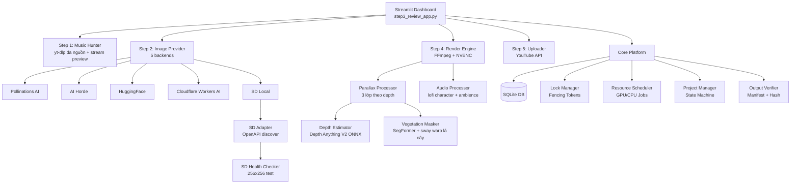

# 🎵 Lofi Studio AI — Tự động hoá tạo video Lofi

> **Bộ công cụ tự động hoàn chỉnh** để tạo video Lofi chất lượng cao: từ tìm kiếm nhạc bản quyền tự do → sinh ảnh nền AI → dựng video với hiệu ứng → tải lên YouTube, tất cả điều khiển qua một Dashboard trực quan.

[](https://python.org)
[](https://streamlit.io)
[](LICENSE)

---

## 📋 Mục lục

- [Tính năng nổi bật](#-tính-năng-nổi-bật)
- [Yêu cầu hệ thống](#-yêu-cầu-hệ-thống)
- [Cài đặt & Khởi chạy nhanh](#-cài-đặt--khởi-chạy-nhanh)
- [Cấu trúc dự án](#-cấu-trúc-dự-án)
- [Hướng dẫn sử dụng Dashboard](#-hướng-dẫn-sử-dụng-dashboard)
- [Cài đặt Stable Diffusion Local](#-cài-đặt-stable-diffusion-local)
- [Cấu hình nâng cao](#-cấu-hình-nâng-cao)
- [Kiến trúc kỹ thuật](#-kiến-trúc-kỹ-thuật)
- [Bộ kiểm thử tự động](#-bộ-kiểm-thử-tự-động)

---

## ✨ Tính năng nổi bật

| Tính năng | Mô tả |
|---|---|
| 🎵 **Tìm nhạc đa nguồn** | Duyệt song song 4 nguồn whitelist (SoundCloud NCS/free + YouTube NCS/free) qua `yt-dlp`, tự khử trùng lặp, lọc mix dài & label thương mại |
| ▶️ **Nghe thử không cần tải** | Phát stream trực tiếp trong Dashboard qua `yt-dlp -g`, không tải file về máy |
| 🎨 **Sinh ảnh nền AI (5 nguồn)** | Pollinations AI, AI Horde, Hugging Face, Cloudflare Workers AI, Stable Diffusion Local — thứ tự ưu tiên cấu hình được qua `.env` |
| ✍️ **LLM viết prompt theo bài nhạc** | Mỗi lần bấm sinh một bối cảnh khác cùng mood (miễn phí qua Pollinations, hoặc cắm key Groq/OpenRouter/Gemini) |
| 🏔️ **Parallax 2.5D theo độ sâu thật** | Tách 3 lớp bằng Depth Anything V2 (onnxruntime CPU, ~1s/ảnh); chuyển động camera-pan vật lý (lớp gần dịch nhiều) + zoom Ken Burns chậm, nối segment liền mạch |
| 🍃 **Chuyển động sống theo từng lớp** | Tự nhận diện từ prompt: mây hậu cảnh trôi chậm, đèn thành phố nhấp nháy nhè nhẹ — trung cảnh giữ yên |
| 🌿 **Lá cây lay riêng từng vùng** | Segmentation thực vật (SegFormer ONNX ~4MB, CPU) + warp displace FFmpeg với sóng sin lệch pha — từng cụm lá lay nhịp riêng như gió thổi, vật thể khác đứng yên |
| ✨ **Hiệu ứng sinh bằng code** | Mưa rơi/tuyết rơi/bụi bay có quỹ đạo thật + scanline + film grain, lặp khít (seamless loop), không cần tải footage |
| 🎧 **Chất âm lofi đặc trưng** | Slowed 0.88x + lowpass ấm + compressor; tiếng mưa & vinyl crackle tự sinh bằng code |
| 🎬 **Dựng video GPU** | Render Full HD 1920×1080 với NVENC (GPU) hoặc libx264 (CPU), có hiệu ứng overlay |
| 🛡️ **Kiểm soát bản quyền** | Hệ thống schema & kiểm duyệt quyền tác giả trước khi xuất bản |
| 📊 **Dashboard trực quan** | Giao diện Streamlit wizard 5 bước, điều hướng có điều kiện, preview trực tiếp |
| 🤖 **Quản lý SD Local** | Trỏ đến AUTOMATIC1111 có sẵn **hoặc** để App tự tải & cài đặt — xem [hướng dẫn bên dưới](#-cài-đặt-stable-diffusion-local) |
| ✅ **Bộ kiểm thử đầy đủ** | 13 unit test tự động bao phủ DB, lock, scheduler, render, SD gates, audio vibe, upscale, parallax |

---

## 💻 Yêu cầu hệ thống

| Thành phần | Tối thiểu | Khuyến nghị |
|---|---|---|
| **OS** | Windows 10 64-bit | Windows 11 64-bit |
| **Python** | 3.10+ | 3.11+ |
| **RAM** | 8 GB | 16 GB |
| **GPU (tuỳ chọn)** | NVIDIA 4GB VRAM | NVIDIA RTX 3050 Ti+ |
| **Ổ cứng trống** | 5 GB | 15 GB (nếu cài SD Local) |
| **FFmpeg** | Bắt buộc | Bắt buộc |
| **Git** | Cần nếu cài SD Auto | Cần nếu cài SD Auto |

> **Lưu ý:** App chạy hoàn toàn offline sau khi cài đặt. Kết nối Internet chỉ cần cho bước tìm nhạc và tải ảnh từ nguồn trực tuyến.

---

## 🚀 Cài đặt & Khởi chạy nhanh

### Bước 1: Clone repository

```bash
git clone https://github.com/MTrong2004/Lofi_Auto.git
cd Lofi_Auto
```

### Bước 2: Cài đặt dependencies

```bash
pip install -r requirements.txt
```

> **Đảm bảo FFmpeg đã được cài đặt và có trong PATH:**
> Tải từ https://ffmpeg.org/download.html hoặc dùng `winget install ffmpeg`

> **Lưu ý:** Lần đầu render với Parallax, app tự tải 2 model ONNX từ HuggingFace
> về `data/models/` (chỉ tải một lần): Depth Anything V2 Small (~25MB, tách lớp
> theo độ sâu) và SegFormer-B0 ADE20K (~4.4MB, mask vùng cây lá cho hiệu ứng lay).

### Bước 3: Khởi chạy Dashboard

```bash
python -m streamlit run step3_review_app.py
```

Dashboard tự động mở trên trình duyệt tại `http://localhost:8501`.

### (Tuỳ chọn) Chạy qua dòng lệnh

```bash
# Kiểm tra hệ thống nhanh
python system_check.py

# Chạy pipeline test 10 giây
python main.py --test

# Chạy pipeline đầy đủ
python main.py
```

---

## 📁 Cấu trúc dự án

```
lofi_automation/
├── 📄 main.py                    # Pipeline orchestrator chính
├── 📄 app_server.py              # Server API FastAPI (REST backend)
├── 📄 config.py                  # Cấu hình toàn cục (paths, API keys)
├── 📄 system_check.py            # Kiểm tra phần cứng & dependencies
├── 📄 test_suite.py              # Bộ 13 unit test tự động
├── 📄 requirements.txt           # Danh sách dependencies
│
├── 📄 .env.example               # Mẫu cấu hình môi trường (chép thành .env)
│
├── 🎵 step1_music_hunter.py      # Tìm nhạc đa nguồn (SoundCloud + YouTube) & stream preview
├── 🎨 step2_image_provider.py    # Sinh ảnh nền AI (5 provider) & bộ hiệu ứng code
├── 🖥️  step3_review_app.py        # Streamlit Dashboard chính (wizard 5 bước)
├── 🎬 step4_render.py            # Engine dựng video FFmpeg
├── ☁️  step5_uploader.py          # Tải video lên YouTube
│
├── utils/
│   └── 📄 helpers.py             # Các hàm bổ trợ (LLM prompt, metadata, retry)
│
└── core/                        # Các module lõi
    ├── 📄 db.py                  # SQLite database & migrations
    ├── 📄 schemas.py             # Schema validation (12 schemas)
    ├── 📄 project_manager.py     # Quản lý vòng đời Project
    ├── 📄 lock_manager.py        # Distributed locking & fencing tokens
    ├── 📄 resource_scheduler.py  # GPU/CPU job scheduler
    ├── 📄 render_worker.py       # Worker render phân đoạn video
    ├── 📄 audio_processor.py     # Chất âm lofi, LUFS, loop crossfade, ambience code
    ├── 📄 depth_estimator.py     # Depth Anything V2 (onnxruntime) cho parallax
    ├── 📄 vegetation_masker.py   # SegFormer ADE20K - mask vùng cây lá cho warp
    ├── 📄 parallax_processor.py  # Tách lớp theo depth, sway maps & filter parallax FFmpeg
    ├── 📄 image_upscaler.py      # Upscale ảnh nền
    ├── 📄 cache_manager.py       # SHA-256 cache & dedup
    ├── 📄 media_probe.py         # FFprobe audio/video analysis
    ├── 📄 output_verifier.py     # Xác minh video đầu ra & manifest
    ├── 📄 provider_capability.py # Registry khả năng image providers
    └── 📄 sd_manager.py          # Quản lý Stable Diffusion Local WebUI (adapter, health, installer, process, model)
```

---

## 🖥️ Hướng dẫn sử dụng Dashboard & API

Dự án cung cấp hai giao diện chính để thao tác và kiểm soát:

### 1. Dashboard Trực quan (Khuyến nghị)
Giao diện **Streamlit** (tích hợp wizard 5 bước) giúp người dùng thực hiện toàn bộ quy trình: cấu hình, duyệt/tải nhạc, sinh ảnh AI, chọn hiệu ứng và render.

Khởi chạy bằng lệnh:
```bash
python -m streamlit run step3_review_app.py
```
Mở trình duyệt truy cập: **`http://localhost:8501`**

#### Các bước thực hiện trên Dashboard:
- **Bước 1 — ⚙️ Cấu hình hệ thống**: Thiết lập thư mục lưu đầu ra, chọn AI Image Provider (Pollinations / AI Horde / Hugging Face / SD Local) và quản lý SD WebUI.
- **Bước 2 — 🎵 Tìm nhạc**: Lọc theo danh mục hoặc tìm tự do, nghe thử trực tuyến không cần tải, xem bản quyền và chọn nhạc.
- **Bước 3 — 🎨 Sinh ảnh & Hiệu ứng**: Nhập prompt mô tả (hoặc sinh prompt ngẫu nhiên bằng LLM), chọn hiệu ứng overlay (mưa, bụi, film grain, scanlines...).
- **Bước 4 — 🚀 Dựng video**: Kiểm tra lại thông số và tiến hành Render video Full HD.
- **Bước 5 — ☁️ Tải lên**: Tải video về máy hoặc upload trực tiếp lên YouTube.

### 2. Backend REST API
Hệ thống cung cấp một REST API (FastAPI) để tích hợp với các công cụ tự động hóa hoặc giao diện bên ngoài.

Khởi chạy backend API bằng lệnh:
```bash
python app_server.py
```
Xem tài liệu API (Swagger UI) và test trực tuyến tại: **`http://127.0.0.1:8000/docs`**

---

## 🤖 Cài đặt Stable Diffusion Local

Dashboard cung cấp **hai chế độ** để tích hợp AUTOMATIC1111 WebUI vào pipeline tạo ảnh:

### Chế độ 1 — 📁 Trỏ đến bản đã cài sẵn (Khuyến nghị)

Nếu bạn **đã cài AUTOMATIC1111** trên máy, chọn chế độ này:

1. Trong Tab 1, chọn **Stable Diffusion Local** làm nhà cung cấp ảnh
2. Cuộn xuống phần **🛠️ Trình quản lý Stable Diffusion**
3. Chọn radio **"📁 Trỏ đến bản đã cài"**
4. Nhập đường dẫn thư mục gốc AUTOMATIC1111 (ví dụ: `D:/stable-diffusion-webui`)
5. App tự động phát hiện `webui-user.bat` / `launch.py` và xác nhận
6. Bấm **💾 Lưu đường dẫn & Áp dụng**
7. Bật API flag trong `webui-user.bat`:
   ```batch
   set COMMANDLINE_ARGS=--api --medvram
   ```
8. Khởi động trực tiếp bằng cách bấm nút **🟢 Bật Stable Diffusion** ngay trên giao diện (hoặc khởi chạy thủ công) → Bấm **🔗 Kiểm tra kết nối**

> **App không thay đổi bất kỳ file nào** trong thư mục cài đặt của bạn.

### Chế độ 2 — 🚀 Để App tự động tải & cài đặt

Nếu bạn **chưa có AUTOMATIC1111**, App sẽ cài đặt hoàn toàn tự động:

1. Chọn radio **"🚀 Để App tự động tải & cài đặt"**
2. Nhập đường dẫn thư mục đích (cần ≥10GB trống)
3. Bấm **🩺 Kiểm tra phần cứng** để xác minh điều kiện
4. Bấm **🚀 Bắt đầu tải & cài đặt tự động**
5. App sẽ tự động:
   - Chạy kiểm tra phần cứng (OS, GPU/VRAM, RAM, Disk, Port, Python/Git)
   - Clone AUTOMATIC1111 v1.6.0 và tạo Python Virtual Environment trong thư mục Staging cô lập
   - Cài PyTorch CUDA + các thư viện cần thiết
   - Quét và vô hiệu hóa các extension không nằm trong allowlist đã phê duyệt
   - Swapping/Promoting atomic từ staging sang active (và Rollback tự động phục hồi bản cũ nếu có lỗi)
6. Sau khi cài xong, dùng **🎛️ Bảng điều khiển Server** để Start/Stop

> **An toàn & Bảo mật:** App chỉ cài vào thư mục bạn chỉ định, tự động cô lập staging/rollback, kiểm duyệt extension an toàn và chỉ lắng nghe trên cổng loopback 127.0.0.1.

---

## ⚙️ Cấu hình nâng cao

Cấu hình qua file **`.env`** (chép từ [`.env.example`](.env.example), đã nằm trong `.gitignore`):

```bash
# Thứ tự ưu tiên provider ảnh
# Máy KHÔNG có GPU:  pollinations,aihorde,sdlocal
# Máy CÓ GPU:        sdlocal,pollinations,aihorde
IMAGE_PROVIDER_ORDER=pollinations,aihorde,sdlocal

# Stable Diffusion Local (xem hướng dẫn bên dưới để cài trên máy GPU)
SD_LOCAL_API_URL=http://127.0.0.1:7860
SD_LOCAL_CHECKPOINT=meinamix_v12Final.safetensors
SD_LOCAL_WIDTH=1024
SD_LOCAL_HEIGHT=576
SD_LOCAL_STEPS=28
SD_LOCAL_CFG_SCALE=7
SD_LOCAL_SAMPLER=DPM++ 2M Karras

# API keys tùy chọn (provider nào thiếu key sẽ tự bị bỏ qua)
# AI_HORDE_API_KEY=          # stablehorde.net - ưu tiên hàng đợi
# HUGGINGFACE_TOKEN=         # huggingface.co/settings/tokens
# CLOUDFLARE_ACCOUNT_ID=     # dash.cloudflare.com -> Workers AI
# CLOUDFLARE_API_TOKEN=
# PEXELS_API_KEY=            # tải video hiệu ứng overlay
# POLLINATIONS_API_KEY=

# LLM viết prompt ảnh theo bài nhạc (mặc định Pollinations miễn phí, không cần key)
# PROMPT_API_URL=https://text.pollinations.ai/openai
# PROMPT_API_KEY=            # key Groq / OpenRouter / Gemini... nếu muốn
# PROMPT_API_MODEL=openai
```

Các mặc định khác (prompt ảnh, negative prompt, tempo lofi, bitrate video...)
nằm trong [`config.py`](config.py) và đều đọc được từ biến môi trường cùng tên.

### Ghi chú chất lượng ảnh

- Prompt mặc định mô tả tường minh **3 tầng cảnh** (tiền/trung/hậu cảnh) để phục vụ hiệu ứng Parallax 2.5D.
- Negative prompt chặn ảnh tả thực (`photorealistic, photo, 3d render...`) — đầu ra luôn là tranh vẽ/anime.
- Payload SD dùng sampler DPM++ 2M Karras, CFG 7, Clip skip 2 (chuẩn checkpoint anime SD 1.5).

---

## 🏗️ Kiến trúc kỹ thuật



### Cơ chế bảo vệ dữ liệu

- **Atomic Write:** Mọi file metadata đều được ghi nguyên tử (`write → fsync → os.replace`)
- **Fencing Tokens:** Ngăn race condition khi nhiều worker cùng truy cập tài nguyên
- **Exclusive Model Lease:** Ngăn xung đột checkpoint SD khi nhiều job GPU chạy đồng thời
- **Schema Validation:** 12 schemas kiểm tra toàn vẹn dữ liệu trước khi ghi DB

---

## 🧪 Bộ kiểm thử tự động

Chạy toàn bộ 13 unit test:

```bash
python -m unittest test_suite
```

| Test | Phạm vi kiểm thử |
|---|---|
| `test_01` | Kiểm tra bảng và schema SQLite |
| `test_02` | Atomic file writer & fsync |
| `test_03` | Lock Manager & Fencing Token |
| `test_04` | Resource Scheduler job lifecycle |
| `test_05` | Worker process tree termination |
| `test_06` | Output Verifier & Manifest |
| `test_07` | **SD Gates G3/G4** — SDAdapter, SDModel, Health Check (mocked) |
| `test_08` | **SD Installer Preflight** — Giả lập phần cứng & điều kiện |
| `test_09` | **SD Installer Staging/Rollback** — Quy trình promote & rollback tự động |
| `test_10` | **SD Installer Extension Allowlist** — Lọc và vô hiệu hóa extension lạ |
| `test_11` | **Audio chuẩn hóa & Vibe** — LUFS, mix ambience, preview 3 vibe |
| `test_12` | **Image Upscale fallback** — Phóng ảnh khi thiếu SD API |
| `test_13` | **Parallax rendering** — Tách lớp (depth/geometric) & filter complex |

---

## 📜 Giấy phép

Dự án phát hành dưới giấy phép **MIT License**.  
Âm nhạc được sử dụng phải tuân thủ giấy phép của nguồn gốc (CC, SoundCloud terms...).

---

## 👤 Tác giả

**MTrong2004** — [GitHub](https://github.com/MTrong2004/Lofi_Auto)

> *Được phát triển với sự hỗ trợ của Antigravity AI (Google DeepMind)*
